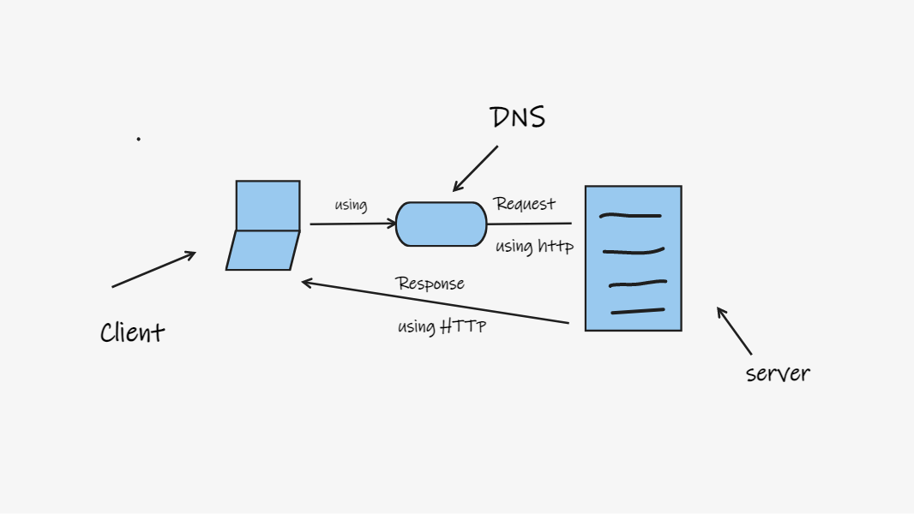

# Project Name - Project Version

**Author Name**: Motasem alkilani

## WRRC

## Overview

## Getting Started
if u have all the instaltion right
1-run the ubuntut 
2-open the requied folder project
3-enter npm start
4-run the browser
5-enter localhost/3000
6-done.

## Project Features
-u can show the page through localhost url and can show error from server or client.
-now we have page that have trends movies ,
and there other page show movies names.
##Question
-I got confused by one of the requirment ("Take a look around the Movie DB Documentation and choose two more routes that interest you and add them to your project".) ,i dont know what to do for this.

-this task is not bad compared to what I expected.
